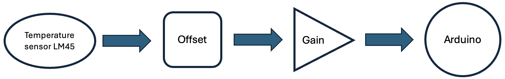
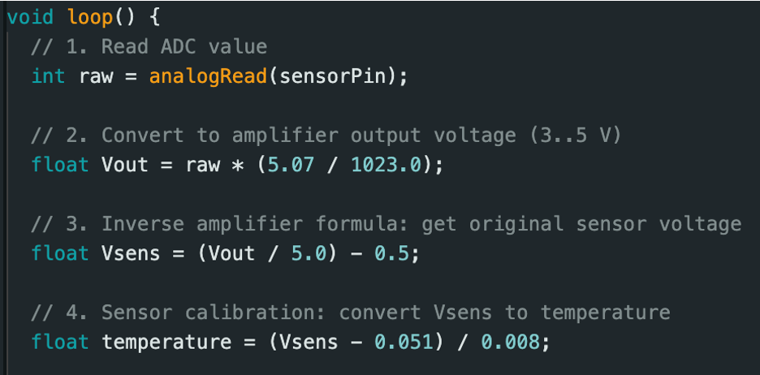

# Greenhouse Monitoring System – Temperature Sensing Module

Team of 4 students.  
My role: temperature sensing module designer.  
Designed and implemented an LM35-based temperature sensing module with analog signal conditioning, calibration, and hardware-level error detection.  
The project consists of two stages: a standalone temperature sensing module and system integration with enclosure.

---

## Overview

- **Full project description:** [Overview](docs/overview.md)
- **Skills Developed:** Designing operational amplifier circuit, sensor calibration and parameter identification, embedded system implementation in Arduino, 3D CAD modelling.
- **Features:** OpAmp-based gain and offset correction, Arduino ADC inverse mapping, sensor error detection, custom 3D-printed enclosure.
- **Technology:** Arduino, LM35 temperature sensor, LM741 operational amplifier, Resistors, OLED display, LEDs.
- **Simulation:** Analog part designed in [Multisim](schematic/multisim); Enclosure model designed in [Autodesk Fusion 360](schematic/cad).
- **Language:** C/C++ (Arduino).

---

# Stage 1 - Temperature Sensor

## Problem Statement

The LM35 temperature sensor provides a low-level output (~10 mV/°C).  
The Arduino ADC operates over a much higher voltage range:from 3 V to 5 V.  
Such a small sensor voltage results in poor ADC resolution and reduced measurement accuracy.  
To obtain valid and reliable temperature readings, the signal must be shifted and amplified into a suitable voltage range.  
This is achieved using LM741 operational amplifiers and resistive networks.

## Design Demonstration

**Hardware Implementation**

**Circuit in Multisim**

`Highlighted input and output voltage levels confirm correct signal conditioning before ADC conversion.`

## Calibration & Arduino Processing

At temperature extremes, the LM35 sensor output may deviate from its ideal linear behaviour, resulting in measurement offsets and scaling errors.
To improve accuracy, a linear calibration model was derived:  

`T = (Vsens − 0.051) / 0.008`

➡️ [View detailed calibration process here](docs/calibration.md)  

**Arduino Code**

`1. The ADC value is read and converted to the amplifier output voltage using a measured reference voltage.`  
`2. Next, the inverse gain and offset are applied to reconstruct the equivalent LM35 sensor voltage.`   
`3. Finally, the calibrated linear model is used to convert the sensor voltage into a temperature value.`

## Problem Solving Process

**Full list of challenges and solutions:** [Problems & Solutions](docs/problems_solutions.md)

**Example of handwritten notes:** 

