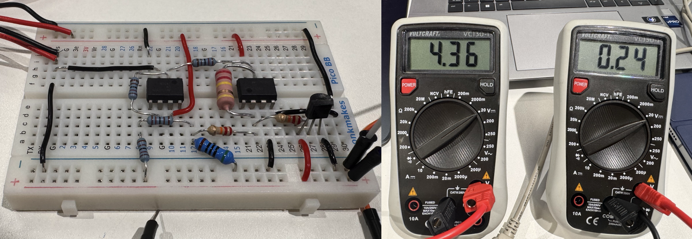
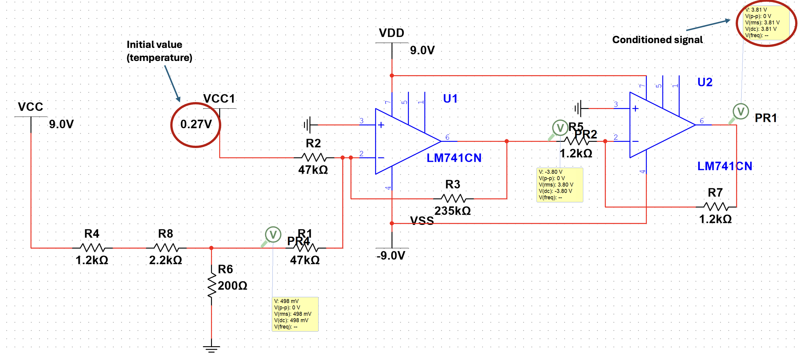
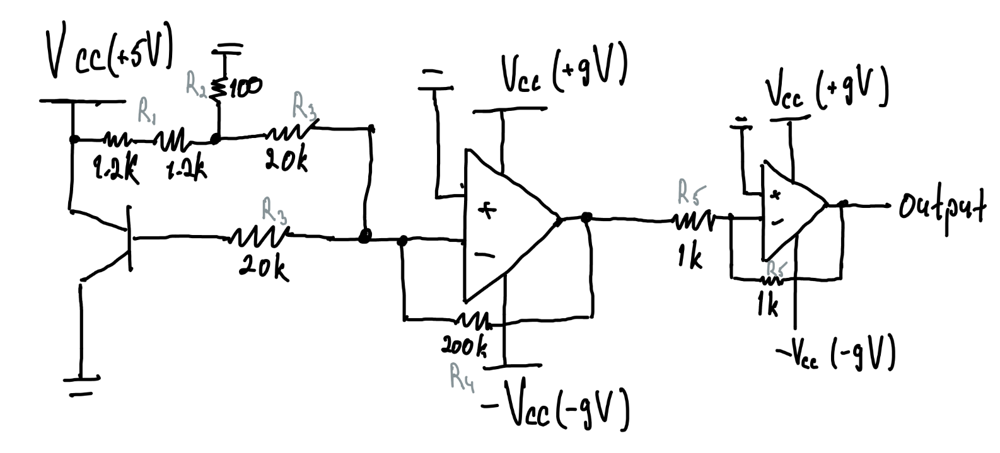
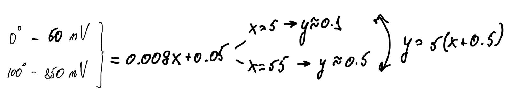
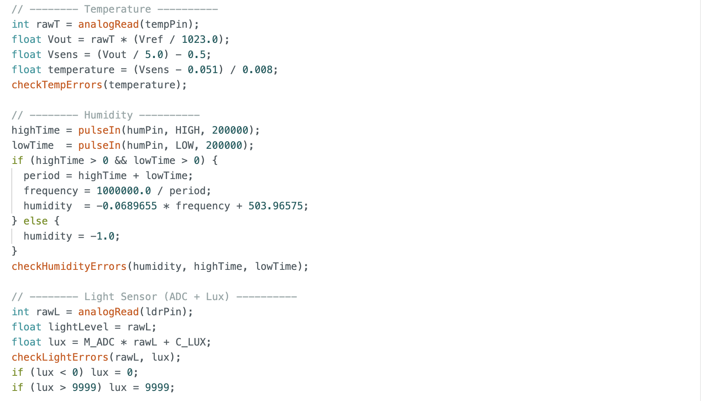
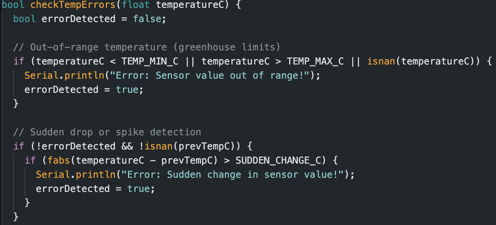
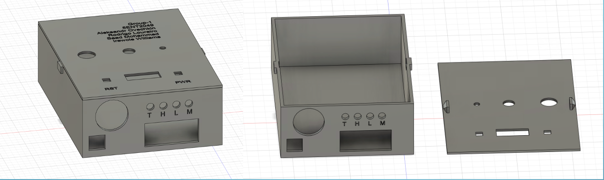
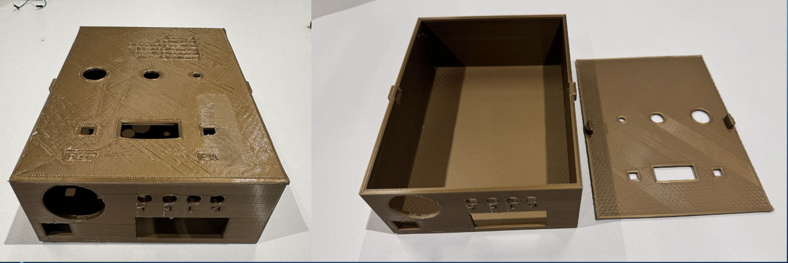

# Greenhouse Monitoring System – Temperature Sensing Module

Team of 4 students.  
My role: temperature sensing module design, multi-sensor integration, and 3D enclosure design.   
Designed and implemented an LM35-based temperature sensing module with analog signal conditioning, calibration, and hardware-level error detection.  
The project consists of two stages: a standalone temperature sensing module and system integration with enclosure.

---

## Overview

- **Full project description:** [Overview](docs/overview.md)
- **Skills Developed:** Designing operational amplifier circuit, sensor calibration and parameter identification, embedded system implementation in Arduino, 3D CAD modelling.
- **Features:** OpAmp-based gain and offset correction, Arduino ADC inverse mapping, sensor error detection, custom 3D-printed enclosure.
- **Technology:** Arduino, LM35 temperature sensor, LM741 operational amplifier, Resistors, OLED display, LEDs.
- **Simulation:** Analog part designed in [Multisim](schematic/multisim/Adder_with_divider_rule); Enclosure model designed in [Autodesk Fusion 360](schematic/cad).
- **Language:** C/C++ (Arduino).

---

# Stage 1 - Temperature Sensor

## Problem Statement

The LM35 temperature sensor provides a low-level output (~10 mV/°C).  
The Arduino ADC operates over a much higher voltage range: from 3 V to 5 V.  
Such a small sensor voltage results in poor ADC resolution and reduced measurement accuracy.  
To obtain valid and reliable temperature readings, the signal must be shifted and amplified into a suitable voltage range.  
This is achieved using LM741 operational amplifiers and resistive networks.

## Design Demonstration

**Hardware Implementation**

**Circuit in Multisim**

`Highlighted input and output voltage levels confirm correct signal conditioning before ADC conversion.`

## Calibration & Arduino Processing

At temperature extremes, the LM35 sensor output may deviate from its ideal linear behaviour, resulting in measurement offsets and scaling errors.
To improve accuracy, a linear calibration model was derived:  

`T = (Vsens − 0.051) / 0.008`

➡️ [View detailed calibration process here](docs/calibration.md)  

**Arduino Code**

`1. The ADC value is read and converted to the amplifier output voltage using a measured reference voltage.`  
`2. Next, the inverse gain and offset are applied to reconstruct the equivalent LM35 sensor voltage.`   
`3. Finally, the calibrated linear model is used to convert the sensor voltage into a temperature value.`

## Problem Solving Process

**Full list of challenges and solutions:** [Problems & Solutions](docs/problems_solutions.md)

**Example of handwritten notes:** 

---

# Stage 2 — System Integration & Enclosure

## Integration of Multiple Sensors

Each sensor processing block is integrated into a single [Arduino](src/all_sensors_pwr_rst_error) `loop()` and organised into clearly separated sections for each sensor. This approach keeps the overall code structure clear and easy to follow.  
Each block includes signal acquisition, conversion to physical units, and their own error detection function.

## Hardware Error Detection

In real-world applications, sensor readings may become unreliable due to hardware-related issues.
These issues include disconnected sensors, short circuits, sudden signal changes caused by noise,
or a sensor becoming stuck at a constant value.

Instead of embedding error checks directly into the main logic, dedicated error-detection functions
were created for each sensor type.
When an error condition is detected, a corresponding LED indicator is activated to provide visual feedback.

**Temperature error detection snippet**

## Enclosure Design & Manufacturing

A custom enclosure was designed to house the Arduino, breadboard, OLED display, buzzer, and supporting circuitry.  
The enclosure was modelled in [Autodesk Fusion 360](schematic/cad) taking into account all components parameters to be correctly implemented into model design.  
One of the distinctive features is a latch mechanism incorporated for easy access for maintenance or debugging.

The final design was manufactured using 3D printing and assembled as a complete physical system.

## Early System Demonstration

## Future Improvements

Although the current system meets all project requirements, several improvements could be implemented
to further enhance functionality, reliability, and scalability.

1. **Measurement Accuracy and Stability**
   - Replace the LM741 with a modern rail-to-rail operational amplifier with low input offset and single-supply operation.
   - This would eliminate the need for ±9 V supplies and reduce DC offset and bias current effects.

2. **Extended Calibration and Temperature Compensation**
   - Perform multi-point calibration across the temperature range instead of using only 0°C and 100°C reference points.
   - Implement lookup-table or polynomial correction in Arduino to improve accuracy over a wider range.

3. **Enhanced Error Detection**
   - Introduce adaptive thresholds for noise detection instead of fixed limits.
   - Automatically exclude invalid sensor readings from display and data transmission.
   - Add error flag logging for post-processing and analysis in MATLAB.

4. **Hardware and Enclosure Improvements**
   - Optimise the enclosure design to improve thermal airflow around the temperature sensor.
   - Add mounting points and cable strain relief for improved robustness and repeatable assembly.

5. **System Functionality Expansion**
   - Add wireless data transmission (Bluetooth or Wi-Fi) for remote monitoring and logging.
